Cordial saludo
# 🚀 Taller: Despliegue de Aplicación con Spring Boot, Docker y AWS EC2

> 📘 **Resumen:**  
> Este proyecto consiste en crear una aplicacion web usando el micro-framework Spring donde se va a construir un container en Docker, luego se crea una maquina virtual (EC2) en AWS donde se despliga el contenedor previamente clonado de Docker Hub, tambien documentar el proceso completo de compilación, contenedorización y despliegue de una aplicación **Spring Boot** utilizando **Docker**, **Docker Hub** y una **instancia EC2 de AWS**.

### ✅ Requisitos para realizar el proyecto
- Conocimientos en el lenguje de programacion Java y la herramienta Maven.  
- Tener instalado Docker Desktop.
- Tener cuenta en Docker Hub.
- Contar con una cuenta en AWS y creditos para crear una instancia.

A continuacion se explicara lo realizado:

Se crea un proyecto Java usando maven  con el siguiente comando:
- mvn archetype:generate -DgroupId=edu.escuelaing.aygo.conatiner -DartifactId=containerapp -DarchetypeArtifactId=maven-archetype-quickstart -DinteractiveMode=false

Se crea una aplicacion Spring pequeña donde se crea 2 clases controlador: HelloRestController y RestServiceApplication

Se importa las dependencias de Spark Java donde se agrega el codigo en el file pom.xml
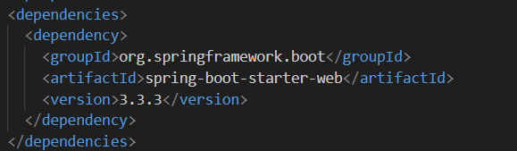

Se asegura que el proyecyo copile con la version 17 de Java
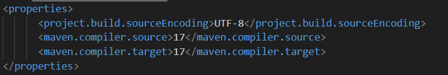

Se asegura que el proyecto compile con el siguiente comando:
- mvn clean install

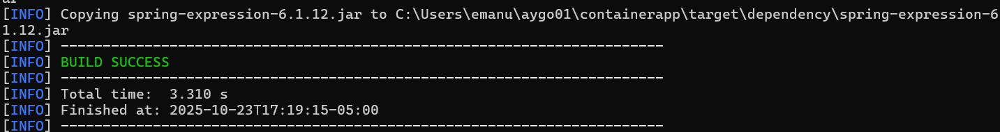

Se inicializa Spring en este caso con el siguiente comando:
- java -cp "target/classes;target/dependency/*" edu.escuelaing.aygo.conatiner.RestServiceApplication

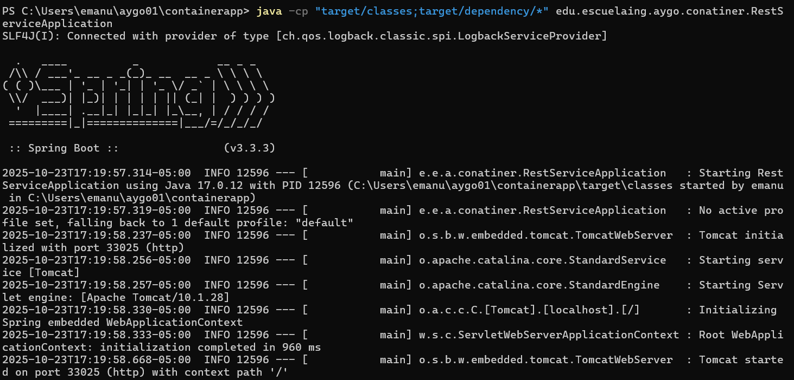

dando como resuiltado:

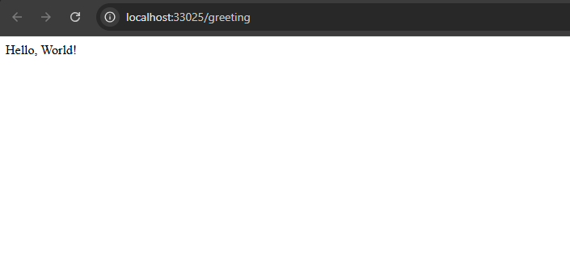

--- 

**Imagenes en Docker:**

Se crea una imagen en Docker con el siguiente comando:
- docker build --tag dockersparkprimer .

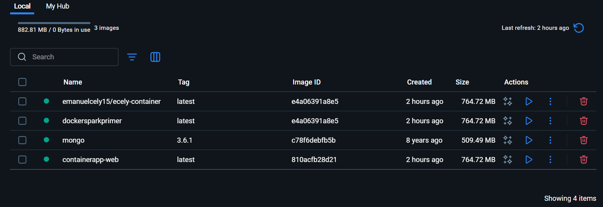

Se crea 3 instancias en un contenedor en Docker con el siguiente comando:
- docker run -d -p 34000:33025 --name firstdockercontainer dockersparkprimer

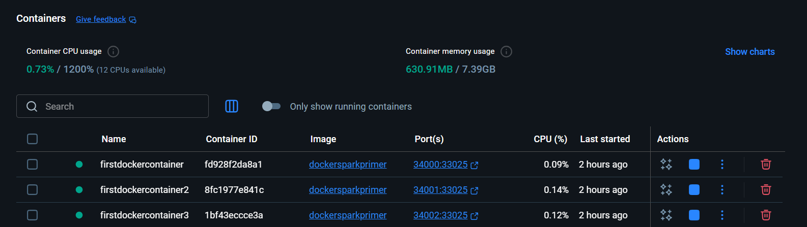

Dando como resultado: 

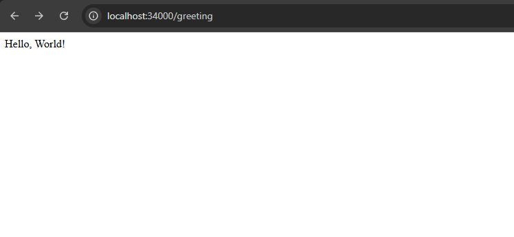

docker-compose donde se crea una instancia a mongo en otro container quedando de la siguiente manera:
- docker-compose up -d

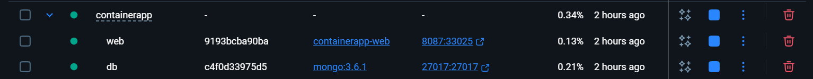

Se sube la imagen a Docker Hub con el siguiente comando:
- docker tag dockersparkprimer emanuelcely15/ecely-container
- docker push emanuelcely15/ecely-container:latest

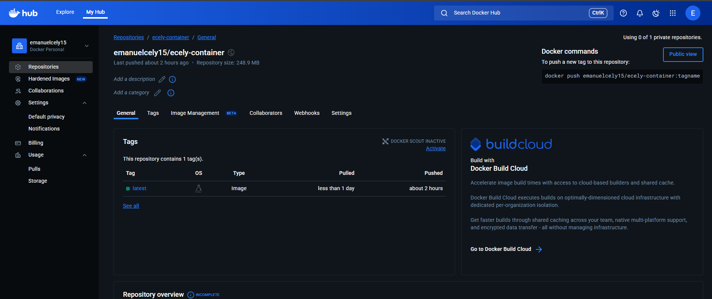
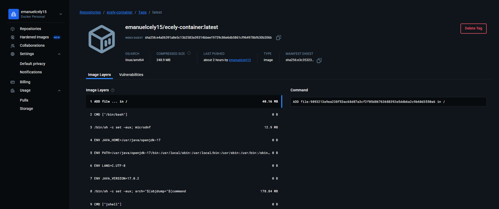

---

**Se crea la maquina virtual en AWS:**

Se crea la instancia:

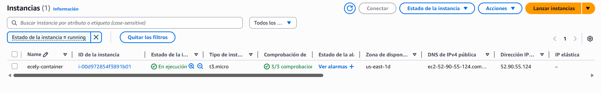

Se conecta y asi se veria la ocnfiguracion general:

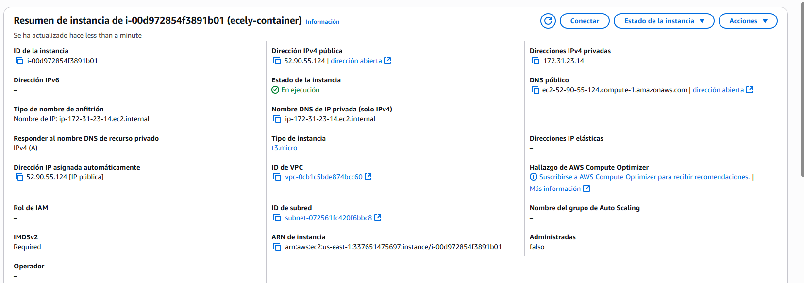

Se crea una carpeta donde se alamcena los pares de llaves:

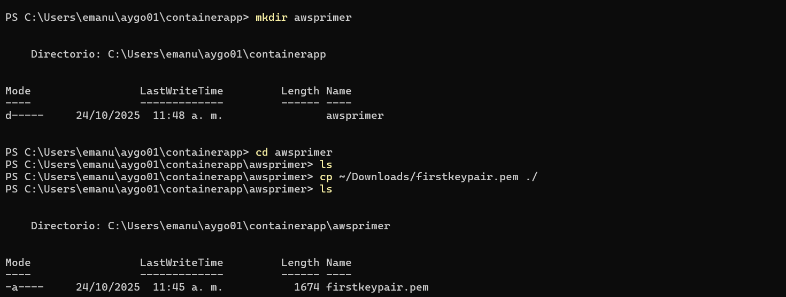

Se conecta a la maquina virtual:

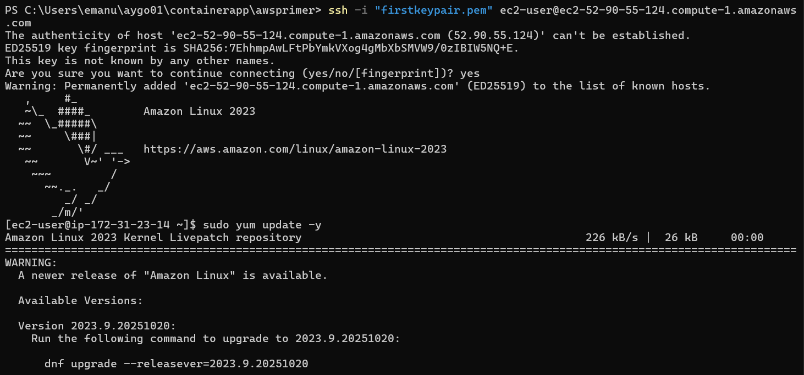

Se instala Docker:
- sudo yum update -y
- sudo yum install docker

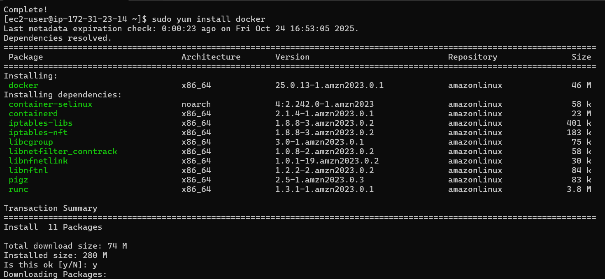

Se inicia el servicio de Docker
- sudo service docker start

Se configura el ususario para que no sea necesario usar "sudo", se sale e ingresa de nuevo a la maquina:
- sudo usermod -a -G docker ec2-user

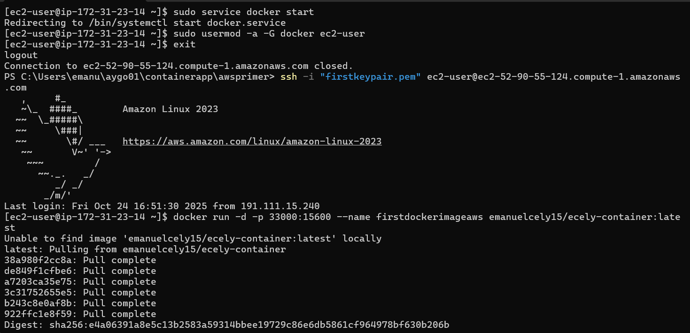

Se crea una instancia del contenedor en Docker Hub a la maquina virtual:
- docker run -d -p 33000:15600 --name firstdockerimageaws emanuelcely15/ecely-container:latest

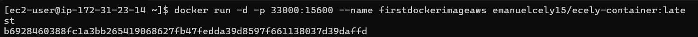

Se hace los cambios en el apartado de seguridad:

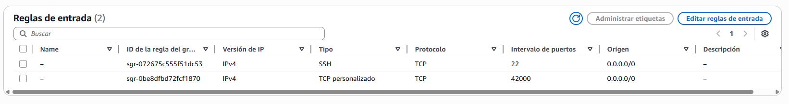

Se verifica que este funcionando en el navegador:

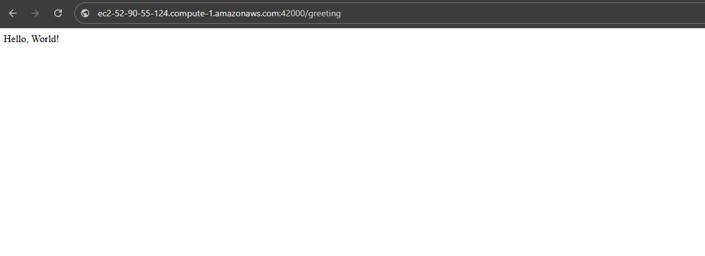

**Muchas gracias.**